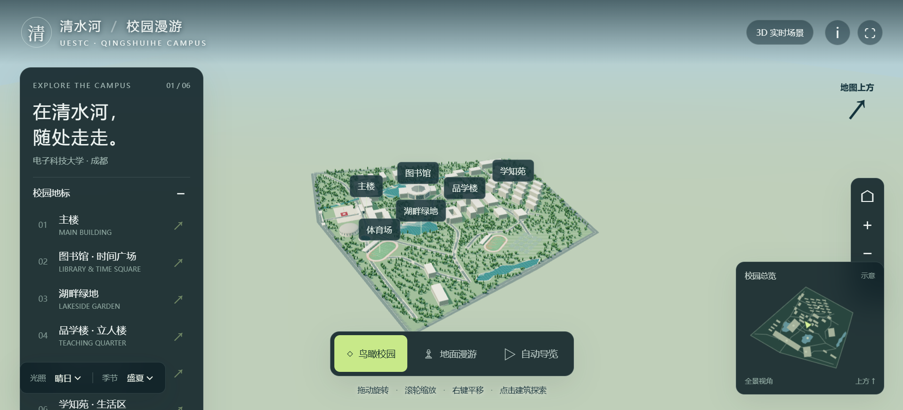
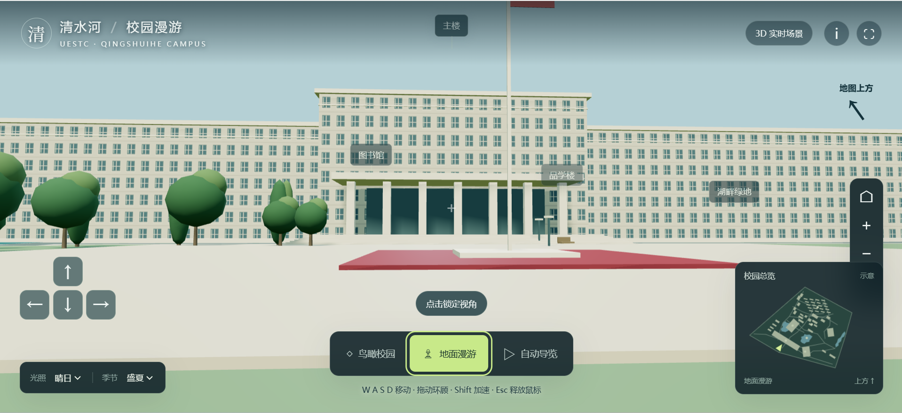

> [!NOTE]
> 本项目为测试GPT-6 Astra自主规划、深度搜索、3D建模能力创建，使用GPT Work，采用一轮提示词交互，提示词为"请使用联网搜索自主规划创建数字版清水河校区"，思考深度为最高，采用1.5倍率加速，耗时16min46s。

# A self-contained Three.js browser reconstruction of the UESTC Qingshuihe campus.

## Show

  
  

## Experience

The page opens directly on a 3D campus. Orbit/pan/zoom, select six landmark groups, explore on foot with WASD or touch controls, follow an automatic tour, and switch between daylight/sunset/night and summer/autumn. The mini-map supports relocation. Ground movement includes building and lake collision checks.

This is an approximate exterior reconstruction from public reference material, not a surveyed digital twin. It does not use camera-based AR, official proprietary 3D meshes, or true building interiors. The planar reference lacks a compass: the orientation widget deliberately reports map-up, not geographical north. Campus geometry is authored in `dist/models.js`; interaction and rendering are in `dist/campus.js`.

## Sources consulted 2026-09-07

- Official campus map (historical examination notice): https://www.mba.uestc.edu.cn/info/1012/1803.htm
- Official main-building aerial: https://news.uestc.edu.cn/info/1002/1192.htm
- Official library exterior and facts: https://xxgkw.uestc.edu.cn/info/1269/6224.htm
- Official interactive map: https://gis.uestc.edu.cn/
- Official panoramic campus tour: https://map.uestc.edu.cn/
- Library aerial reference: https://talent.sciencenet.cn/index.php?s=Info%2Findex%2Fid%2F23496

Public images were used as modeling references; source photographs are not redistributed. The main building's bilateral composition, library octagon/dome, two primary interior lakes, and main campus districts follow these references. Facade module spacing, building heights, dormitory placement, planting and paths are simplified interpretations.

## Runtime

Static assets under `dist/`, with no remote CDN, API, camera or account dependency inside the app. Requires a browser supporting WebGL 2 and ES modules/import maps. Three.js 0.180.0 and its controls/geometry helper are vendored under `dist/vendor/` with their MIT license. Host the directory over HTTP(S); direct file URLs are not supported.

## Validation

JavaScript syntax and complete local module/asset graph checked. CPU construction of the scene checks finite mesh coordinates, landmark boundaries and geometry merging. Browser visual and interaction QA has not been performed in this workflow.
